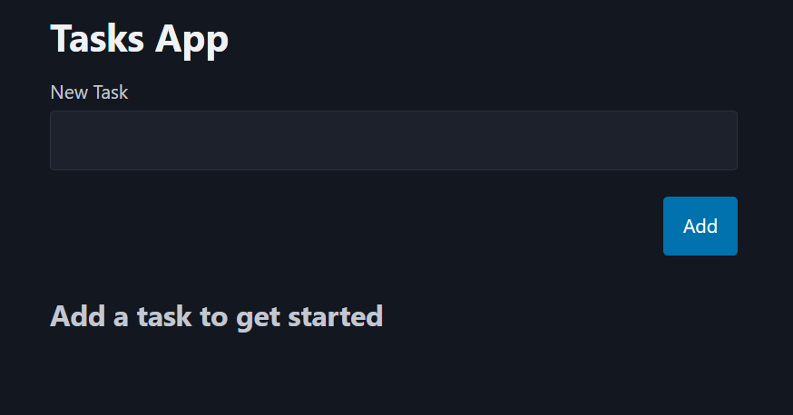
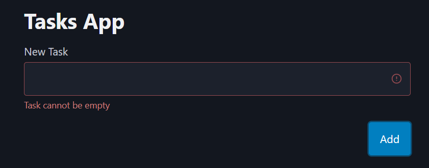
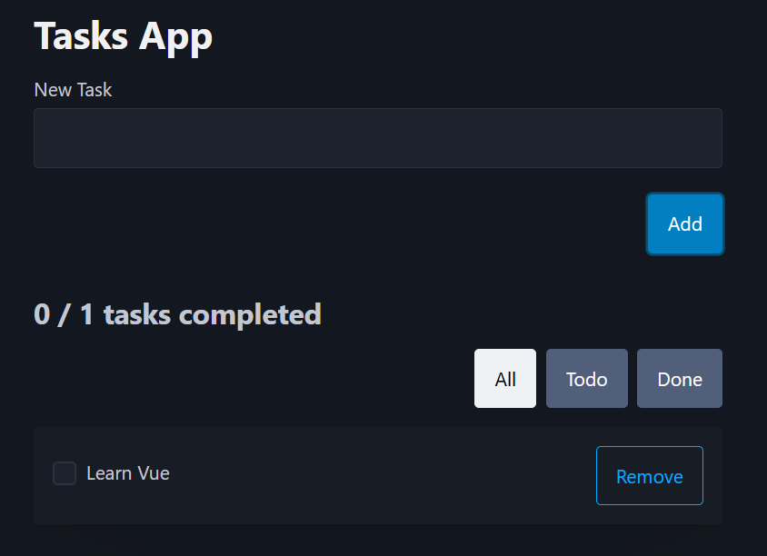
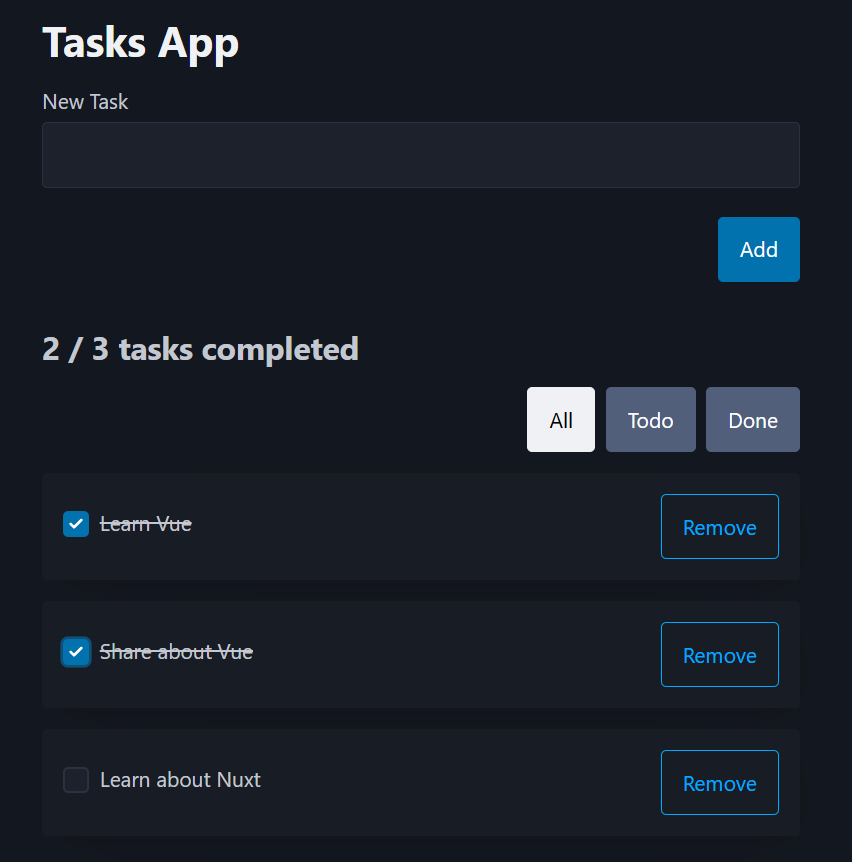
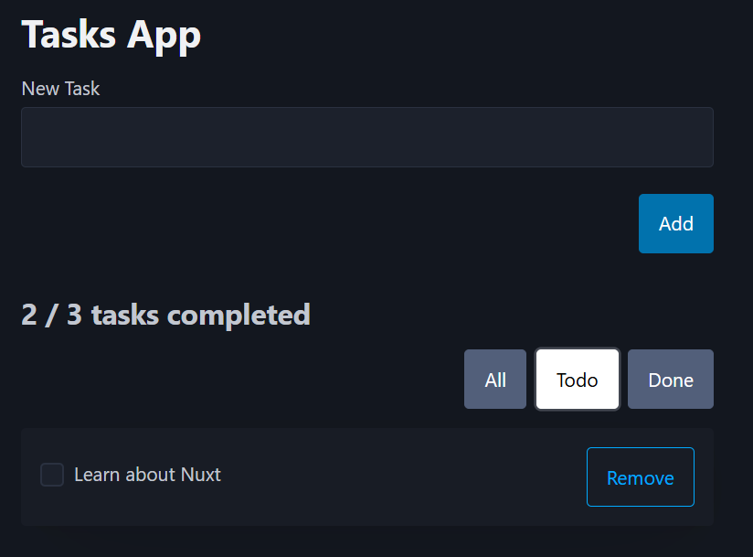
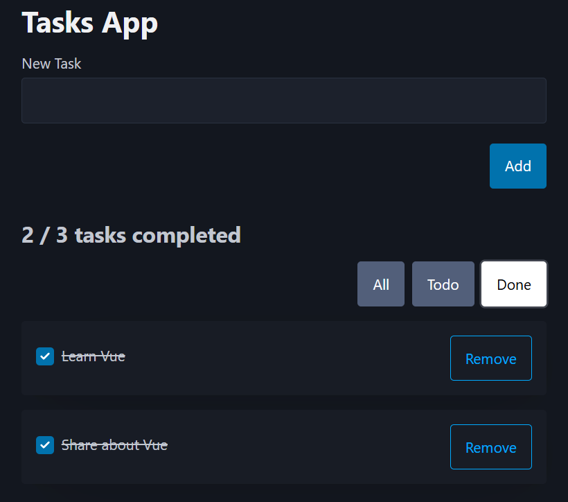

# Vue.js Task App ✅

A simple task or todo app built using Vue.js and Picocss

## How to run 💾

Clone or download the repo

```
https://github.com/Tyriol/vue-task-app.git
```

Navigate to the project folder

```
cd vue-task-app
```

Install dependencies and run the app

```
npm i
npm run dev
```

## Features ✨

- Ability to add tasks, mark as done and remove them
- Validation on the form if the input is empty
- Ability to filter tasks based on done state or all.
- Clean styles from Pico Css and some custom styles

## Tech used 🤖

- [Vue.js](https://vuejs.org/)
- [Vite](https://vite.dev/)
- [Pico CSS](https://picocss.com/)

## Why I built this ❓

I want to learn another framework/library other than React so that I'm less focused on the syntax and more focused on learning how to adapt to different tech. I also want to build a full stack app using Vue and Nuxt and this was the first step as an intro to Vue.

## Screenshots

<div style="display: grid; grid-template-columns: 1fr 1fr 1fr; gap: 6px; justify-content: center;">
    
    
    
    
    
    
</div>

## Future features 💡

In all honesty, this is probably it, so don't expect anything more in this repo 🤣
